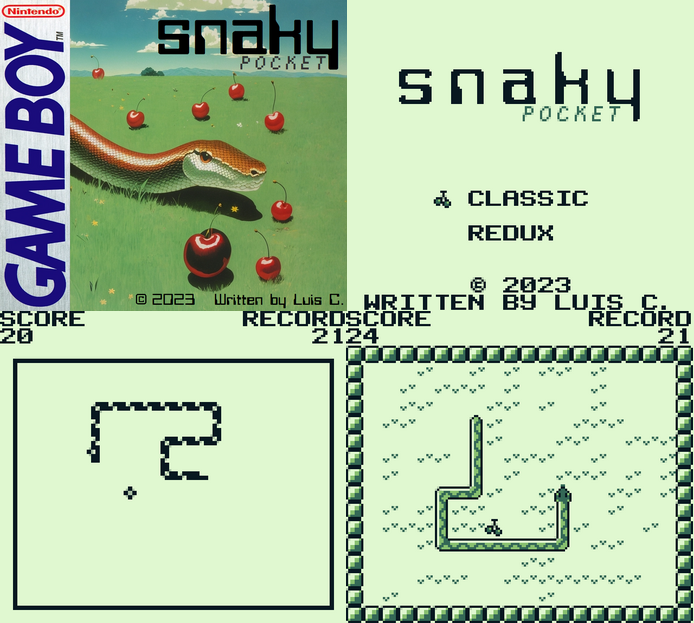

# SNAKY POCKET GB

Snaky Pocket is a Game Boy classic snake game game developed with GBDK-2020. Play with Snaky eating as much fruit as you can to beat your record. You can select between two style modes: Classic (like the Nokia game) and Redux (small remake).

## Compile 🔧

Execute make file in folder terminal:

```
make.bat
```
or
```
.\make.bat
```

## Controls ⌨️

| Action  | Game Boy | Keyboard |
| ------------- | ------------- | ------------- |
| Move  | D-Pad  | Arrow Keys  |
| Select Mode | Select  | Shift  |
| Play/Pause  | Start  | Enter  |

## Written by ✒️

* **Luis Correa Céspedes** - *Email* - luiscorreacespedes@gmail.com

## Screenshots



